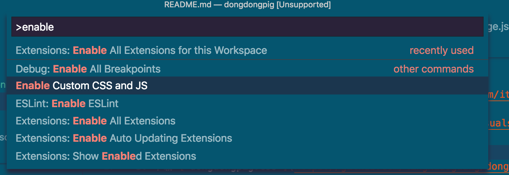

# Dongdong pig - VS Code theme

[中文版本](./README_zh.md) / [English Version](./README.md)


[github](https://github.com/lingxiaoguang/vscode-theme-dongdongpig)

Dongdong is a cute piglet. Let it write code with you every day ~

It will always be on the left side of your editor.


## Feature：

1. There will always be a piglet on the left side of the editor
2. Error prompts, new message prompts are all piglet style
3. Green background color is more comfortable
4. Cleaner code color, plus light-emitting fonts

When enabled, the effect is as follows:


## Installation

1. Install [custom-css-and-js-loader](https://marketplace.visualstudio.com/items?itemName=be5invis.vscode-custom-css) Plugin

2. Enable [custom-css-and-js-loader](https://marketplace.visualstudio.com/items?itemName=be5invis.vscode-custom-css) Plugin:

  > Steps: 
  > - Press `cmd + shift + p`
  > - Input `enable`
  > - Select `enable Custom Css and Js` option




3. Copy [`dongdongpig.css`](https://github.com/lingxiaoguang/vscode-theme-dongdongpig/master/dongdongpig.css) to a local file， Then open `settings.json` configuration as follows:

    Mac：

    ```javascript
    {
      "vscode_custom_css.policy": true,
      "vscode_custom_css.imports": [
        "file:///Users/{File Location}/dongdongpig.css"
        ]
    }
    ```

    Windows:

    ```javascript
    {
      "vscode_custom_css.policy": true,
      "vscode_custom_css.imports": [
        "file://C:/{File Location}/dongdongpig.css"
        ]
    }
    ```

3. Restart will take effect.~

## Thanks

Thank Dongdong for being with me all the time.~


