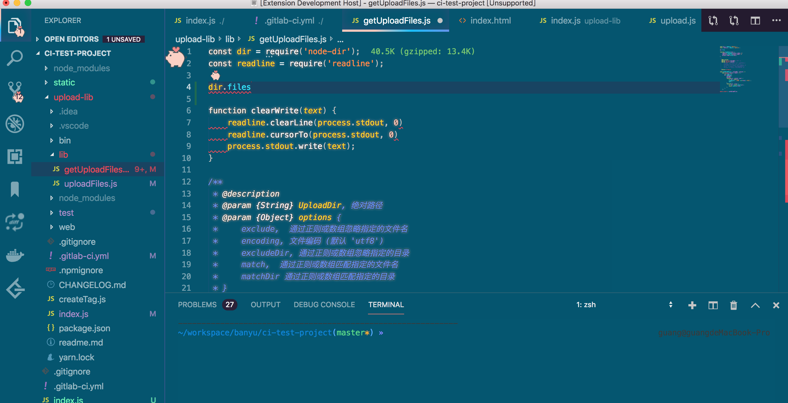

# Dongdong pig - VS Code theme


[源码链接](https://github.com/lingxiaoguang/vscode-theme-dongdongpig)

东东是一头可爱的小猪，让它每天陪着你写代码吧~

他会一直在你编辑器左侧哦~

## 特性：

1. 编辑器左侧会一直有一只小猪
2. 错误提示，新消息提示都是小猪的样式
3. 青绿色的背景颜色比较舒适
4. 较为干净的代码颜色，加上发光字体



## Installation
1. 安装一个插件[custom-css-and-js-loader](https://marketplace.visualstudio.com/items?itemName=be5invis.vscode-custom-css)（支持加载css和js)并且启用


2. 保存[`dongdongpig.css`](https://github.com/lingxiaoguang/vscode-theme-dongdongpig/master/dongdongpig.css)到本地， 然后打开settings.json配置如下

    Mac：

    ```
    {
      "vscode_custom_css.policy": true,
      "vscode_custom_css.imports": [
        "file:///Users/{文件位置}/dongdongpig.css"
        ]
    }
    ```

    Windows:

    ```
    {
      "vscode_custom_css.policy": true,
      "vscode_custom_css.imports": [
        "file://C:/{文件位置}/dongdongpig.css"
        ]
    }
    ```

3. 重启就可以生效啦~

## Thanks

感谢一直陪伴着我的东东~


